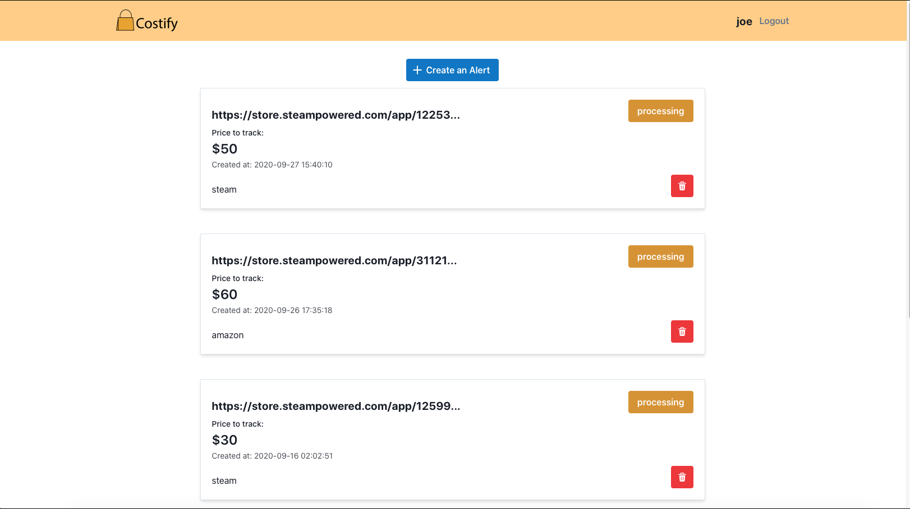

# Costify


Costify is a free price tracking website that notfies you when your favorite products are on sale from the selected websites: Amazon, Steam, Craigslist, Godaddy, and Namecheap.




### Development

cd into web and server directories and run ```yarn install`` respectively to install all dependencies.

run ```yarn dev``` in web directory to start local frontend and ```yarn start``` in server to start local server.

